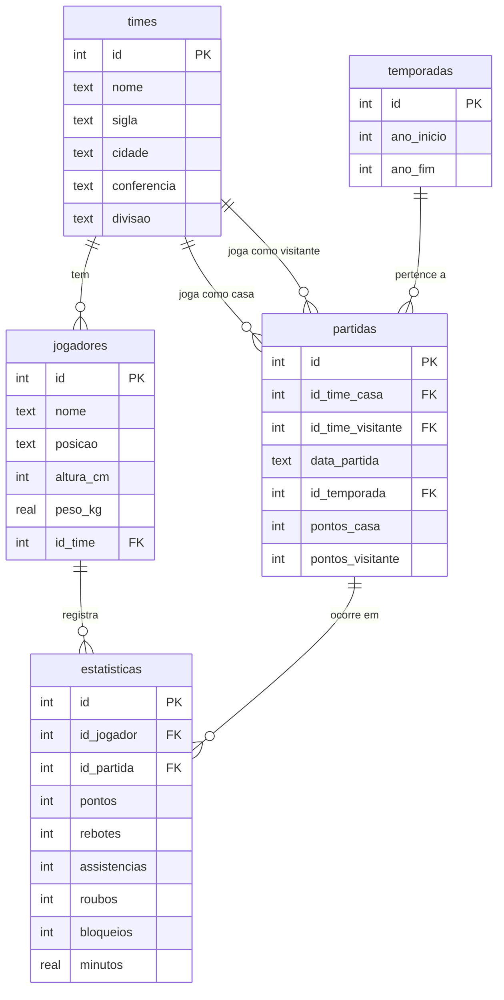

# 🏀 NBA Stats DB

<div align="center">


**Banco de dados relacional da NBA construído do zero com SQLite e Python.**  
Do `SELECT` básico até CTEs, subqueries e views — tudo com dados reais.

</div>

---

## 💡 Sobre o projeto

Este projeto foi desenvolvido para aprofundar conhecimentos em **SQL e modelagem de banco de dados relacional**, usando a NBA como tema — uma das estruturas de dados mais ricas do esporte: times, jogadores, partidas e estatísticas se conectam de formas naturalmente relacionais.

O banco foi construído do zero: modelagem das tabelas, script de seed em Python com dados reais e queries progressivas organizadas por nível de complexidade.

---

## 🗄️ Modelo de dados



| Tabela | Descrição | Registros |
|--------|-----------|:---------:|
| `times` | 8 franquias com conferência e divisão | 8 |
| `jogadores` | Atletas com posição, altura e peso | 19 |
| `temporadas` | Temporada 2023-24 | 1 |
| `partidas` | Jogos com placar e data | 6 |
| `estatisticas` | Stats por jogador por partida | 27 |

---

## 📂 Estrutura

```
nba-stats-db/
├── schema.sql              ← definição das tabelas
├── seed.py                 ← popula o banco com dados reais
├── queries/
│   ├── basico.sql          ← SELECT, WHERE, ORDER BY, LIMIT
│   ├── intermediario.sql   ← JOINs, GROUP BY, agregações
│   └── avancado.sql        ← CTEs, subqueries, HAVING, VIEWS
└── README.md
```

---

## 🚀 Como rodar

```bash
# Clone o repositório
git clone https://github.com/guigs-godoy/nba-stats-db.git
cd nba-stats-db

# Gere o banco de dados
python seed.py

# Explore com o DB Browser for SQLite
# Download gratuito: https://sqlitebrowser.org
```

---

## 📝 Exemplos de queries

<details>
<summary><strong>🟢 Básico — Top 5 jogadores mais altos</strong></summary>

```sql
SELECT nome, altura_cm
FROM jogadores
ORDER BY altura_cm DESC
LIMIT 5;
```
</details>

<details>
<summary><strong>🔵 Intermediário — Média de pontos por jogador</strong></summary>

```sql
SELECT j.nome AS jogador,
       t.nome AS time,
       ROUND(AVG(e.pontos), 1) AS media_pontos
FROM estatisticas e
INNER JOIN jogadores j ON e.id_jogador = j.id
INNER JOIN times     t ON j.id_time    = t.id
GROUP BY j.id
ORDER BY media_pontos DESC;
```
</details>

<details>
<summary><strong>🔴 Avançado — Jogadores acima da média da liga</strong></summary>

```sql
SELECT j.nome AS jogador,
       ROUND(AVG(e.pontos), 1) AS media_pontos
FROM estatisticas e
INNER JOIN jogadores j ON e.id_jogador = j.id
GROUP BY j.id
HAVING AVG(e.pontos) > (
    SELECT AVG(pontos) FROM estatisticas
)
ORDER BY media_pontos DESC;
```
</details>

<details>
<summary><strong>🔴 Avançado — Duplos-duplos e triplos-duplos (CTE)</strong></summary>

```sql
WITH performances AS (
    SELECT id_jogador,
           CASE WHEN pontos       >= 10 THEN 1 ELSE 0 END AS cat_pts,
           CASE WHEN rebotes      >= 10 THEN 1 ELSE 0 END AS cat_reb,
           CASE WHEN assistencias >= 10 THEN 1 ELSE 0 END AS cat_ast
    FROM estatisticas
)
SELECT j.nome AS jogador,
       SUM(CASE WHEN (cat_pts + cat_reb + cat_ast) >= 2 THEN 1 ELSE 0 END) AS duplos_duplos,
       SUM(CASE WHEN (cat_pts + cat_reb + cat_ast) >= 3 THEN 1 ELSE 0 END) AS triplos_duplos
FROM performances p
INNER JOIN jogadores j ON p.id_jogador = j.id
GROUP BY j.id
HAVING duplos_duplos > 0
ORDER BY triplos_duplos DESC, duplos_duplos DESC;
```
</details>

---

## 📚 Conceitos praticados

| Nível | Conceitos |
|-------|-----------|
| 🟢 Básico | `SELECT`, `WHERE`, `ORDER BY`, `LIMIT`, `AS` |
| 🔵 Intermediário | `INNER JOIN`, `LEFT JOIN`, `GROUP BY`, `COUNT`, `AVG`, `SUM`, `MAX`, `MIN`, `ROUND`, `CASE WHEN` |
| 🔴 Avançado | Subqueries, CTEs (`WITH`), `HAVING`, `CREATE VIEW` |

---

<div align="center">
</div>
